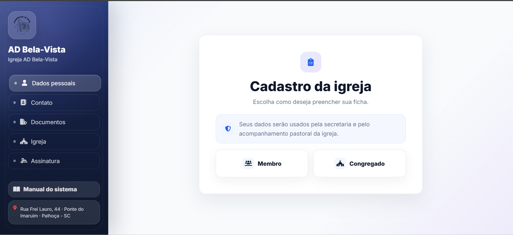
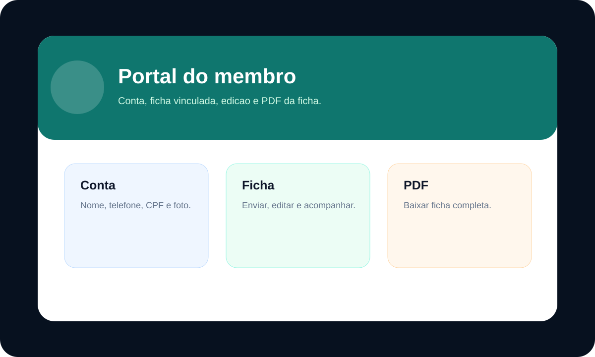
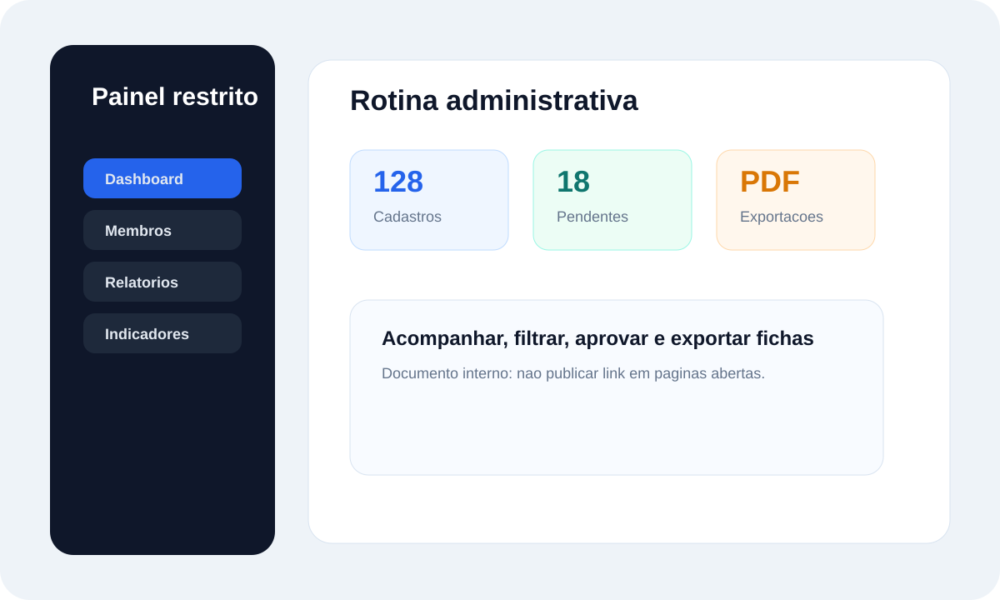

        # AD Bela-Vista - Manual do Usuario

        **Sistema:** Gestao de Membros da AD Bela-Vista  
        **Versao do documento:** 1.2
        **Publico:** pastor, administrador, secretaria, membros e equipe autorizada.

        ---

        ## 1. Visao Geral

        O sistema permite:

        - preencher ficha publica de membro ou congregado;
        - criar conta e acessar o portal do membro;
        - acompanhar fichas vinculadas a uma conta;
        - revisar, aprovar ou solicitar correcao de cadastros;
        - consultar membros no painel administrativo unificado;
        - exportar relatorios em PDF/Excel e gerar PDF completo da ficha;
        - consultar o manual publico da ficha em `public/pages/suporte.html`.

        ### Telas principais

        - `public/pages/cadastro.html`: ficha publica de cadastro.
        - `public/pages/membro-login.html`: login/criacao de conta do membro.
        - `public/pages/membro.html`: portal do membro.
        - `public/pages/admin.html`: painel administrativo unificado.
        - `public/pages/usuarios.html`: cadastro e controle de usuarios administrativos.
        - `public/pages/suporte.html`: manual publico da ficha.

        ### Ilustracoes internas

        
        
        

        ---

        ## 2. Fluxo da Ficha

        ### 2.1 Ficha publica

        1. Abra `public/pages/cadastro.html`.
        2. Aceite os termos de privacidade.
        3. Escolha **Membro** ou **Congregado**.
        4. Preencha os dados solicitados.
        5. Anexe documentos quando necessario.
        6. Registre a assinatura digital.
        7. Clique em **Enviar Cadastro**.

        Cadastros enviados pela ficha publica entram como **Pendente**.

        ### 2.2 Ficha enviada pelo portal do membro

        1. Entre em `public/pages/membro-login.html`.
        2. Acesse `public/pages/membro.html`.
        3. Clique em **Cadastrar meu perfil**.
        4. Envie ou edite a ficha.

        Fichas enviadas ou editadas pelo portal entram como **Em análise**.

        ---

        ## 3. Status da Ficha

        | Status | Significado |
        |---|---|
        | `Pendente` | Cadastro publico recebido e aguardando primeira conferencia. |
        | `Em análise` | Ficha enviada ou alterada pelo membro e aguardando revisao. |
        | `Correção` | Pastor/admin pediu ajuste em alguma informacao. |
        | `Aprovado` | Ficha conferida e aprovada. |
        | `Ativo` | Registro ativo em uso administrativo. |
        | `Inativo`, `Transferido`, `Falecido` | Status administrativos especiais. |

        ---

        ## 4. Acesso

        ### 4.1 Painel administrativo

        1. Abra `public/pages/admin.html`.
        2. Informe e-mail e senha.
        3. Clique em **Entrar no Painel**.

        Roles permitidas:

        - `admin`
        - `pastor`
        - `secretario`

        `admin` e `secretario` podem excluir cadastros. `pastor` acessa o painel sem exclusao.

        ### 4.2 Esqueci minha senha

        No painel administrativo existe fluxo de recuperacao:

        1. Clique em **Esqueci minha senha**.
        2. Informe o e-mail.
        3. Receba o codigo/link por e-mail.
        4. Informe o codigo quando solicitado.
        5. Defina uma nova senha.

        No portal do membro, a recuperacao deve ser solicitada a secretaria ou administracao da igreja.

        ---

        ## 5. Painel Administrativo

        O painel mostra:

        - dashboard com totais e indicadores;
        - ultimo cadastro;
        - aniversariantes;
        - busca e filtros;
        - pendencias de aprovacao;
        - lista de membros/congregados;
        - botao de visualizar ficha;
        - edicao de cadastro;
        - exportacoes PDF/Excel;
        - PDF completo da ficha;
        - cadastro e controle de usuarios administrativos;
        - configuracao de assinatura do pastor.

        ### Aprovacao e correcao

        Na lista, cadastros com status de analise podem ser:

        - aprovados;
        - marcados para correcao;
        - editados;
        - visualizados em PDF.

        ---

        ## 6. Usuarios Administrativos

        A pagina `public/pages/usuarios.html` permite:

        - criar login administrativo;
        - definir perfil `admin`, `pastor` ou `secretario`;
        - listar usuarios do Supabase Auth;
        - atualizar o perfil de um usuario existente.
        - imprimir ficha;
        - abrir novo cadastro.

        A busca deve usar pelo menos 3 letras do nome ou 4 numeros do documento.

        ---

        ## 7. Portal do Membro

        No portal, o membro pode:

        - atualizar dados da conta;
        - enviar ficha vinculada a conta;
        - editar ficha ja enviada;
        - baixar PDF da ficha;
        - acompanhar seus registros.

        Alteracoes feitas pelo membro voltam para **Em análise**.

        ---

        ## 8. Manual/Ajuda

        A antiga area de suporte foi substituida por uma pagina publica de manual da ficha:

        - `public/pages/suporte.html`
        - tambem acessivel por `/suporte.html` no deploy

        Essa pagina explica apenas o preenchimento da ficha publica. Ela nao divulga rotas restritas, nao abre chamado, nao usa chat e nao usa assistente IA.

        ---

        ## 9. Boas Praticas

        - Use contas individuais.
        - Nao compartilhe senhas.
        - Confirme telefone e documento antes de aprovar.
        - Revise anexos sensiveis com cuidado.
        - Use status `Correção` quando o membro precisar ajustar dados.
        - Mantenha o bucket `membros-docs` privado.
